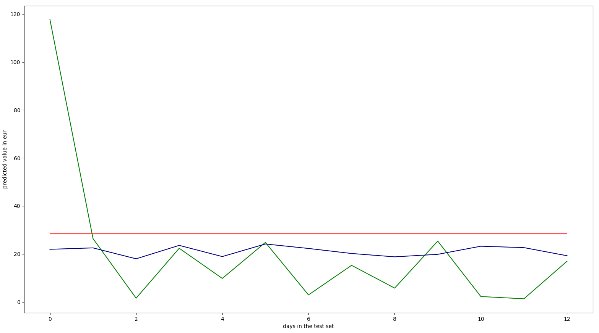

# Daily-Expense-Prediction-and-Analysis-citywise
Analyzed the amount of money being spent every day on transport, food, grocery, etc. also compared cities on the basis of daily expenses. Used the data to predict future expenses. 
# analyzing daily expenses, real use-case


## Objective of the study:

The objective is to answer a series of questions:

1. What percentage of money is spent on groceries, activities, traveling...?
2. What is the preferred public transport?
3. How expensive is each city daily?
4. How much money is spent daily?
5. How much money will be spent in the upcoming days?

## Collecting the data

Due to the specific nature of objectives it is highly unlikely the needed data would have already been collected and published.
That is why, starting from 19th of September 2018, I started keeping track of my daily expenses in the following form:
```
1   hrk - croatian kuna, amount of money spent in the currency of Croatia,
2   vendor - company that I bought an item/service from,
3   date - DD.MM.YYYY or DD.MM.,
4   description - specifically what I spent money on (ice-skating, food, bus, alcohol...),
5   meansofpayment - cash/credit-card/paypal,
6   city - lowercase name of the city,
7   category - more general than description e.g. (bus, train, tram) -> transport,
8   currency - three letter code of the currency e.g. HRK, EUR, PLN...,
9   country - lowercase name of the country (shortened name if possible e.g. czechia),
10  lcy - local currency, amount of money spent in the local currency of current transaction,
11  eur - euro, amount of money spent in euros,
12  tags - something that will remind me of the record,
13  recurrence - is the expense likely to be repeated (yes/no)
```

### Questions 1-4 pseudocode

1. preprocess
  1. read data
  2. fill empty data
    1. date = add year where needed
    2. country = get_country_from_city
    3. currency = get_currency_from_country
    4. currencies
      1. if hrk not set: hrk = lcy * get_rate(currency, 'HRK' date)
      2. if eur not set: eur = hrk * get_rate('HRK', 'EUR', date)
2. plot graphs
  1. category - money pie chart
  2. public transport pie chart
  3. daily city expenses stacked bar chart
  4. daily expense bar chart

## What about question 5?

> how much money will be spent in the upcoming days?

Usually, this would be approached differently;
One would try to evalue which machine learning method would be best suitable for adapting to the plotted function.
But in this case, we'll pretend to be british empiricists, turn a blind eye and just do the simplest method.

### Linear regression pseudocode

1. preprocess
  1. convert data into a daily table, with dates and city information
  2. encode categorical data
  3. avoid the dummy variable trap
  4. split data into test and train sets
  5. feature scale
2. build our regression model
  1. fit the regressor to the train set
  2. remove columns that are not beneficial
    1. backward elimination
  3. predict values
3. plot results

### Multiple linear regression

The city column has to be encoded into <n> columns each representing one city.

```python
x = np.array([*zip(range(len(dates)), cities)])
y = sums
from sklearn.preprocessing import OneHotEncoder
from sklearn.compose import ColumnTransformer, make_column_transformer
preprocess = make_column_transformer((OneHotEncoder(), [-1])).fit_transform(x)
x = np.array([*zip(preprocess, x[:, 0])])
```

Now we have to avoid the
[dummy variable](https://en.wikipedia.org/wiki/Dummy_variable_(statistics)) trap.

```python
x = x[:, 1:]
```

Next up is to split the data into *test* and *train* sets.
80% of the data will be used to train the model, and the rest used for the test set.
`ytest` is the test data we'll compare the regression results to.

```python
from sklearn.model_selection import train_test_split as tts
xtrain, xtest, ytrain, ytest = tts(x, y, test_size = 0.2)
```

Following the pseudocode the regressor should be created and fit to the training set.

```python
from sklearn.linear_model import LinearRegression
regressor = LinearRegression()
regressor.fit(xtrain, ytrain)
```

`ypred` is the list of predicted values using multiple linear regression with
all the data available (dates, cities).

```python
ypred = regressor.predict(xtest)
```

What we could do now is compare the results to the `ytest` and call it a day.
But we're not gonna stop there, let's ask ourselves a question.
How beneficial is the abundace of information we're feeding to the regressor?
Let's build a quick
[backward elimination](https://en.wikipedia.org/wiki/Stepwise_regression#Main_approaches)
algorithm and let it choose the columns it wants to leave inside.
We'll set the [p-value](https://en.wikipedia.org/wiki/P-value)
to the standard `0.05`, sit back, relax, and let the magic unfold.

```python
import statsmodels.formula.api as sm
xopt = np.hstack([np.ones((x.shape[0], 1)), x])
for i in range(xopt.shape[1]):
    pvalues = sm.OLS(y, xopt.astype(np.float64)).fit().pvalues
    mi = np.argmax(pvalues)
    mp = pvalues[mi]
    if mp > 0.05:
        xopt = np.delete(xopt, [mi], 1)
    else:
        break
```

Now all that's left is to split the data again into test and training sets
and get the `ypredopt`, which is the predicted data of `ytest` after employing
backward elimination.

```python
xtrain, xtest, ytrain, ytest = tts(xopt, y, test_size = 0.2, random_state = 0)
regressor = LinearRegression()
regressor.fit(xtrain, ytrain)

ypredopt = regressor.predict(xtest)
```

All that's left is to plot everything and check out the result!

```python
plt.plot(ytest, color = 'green')
plt.plot(ypred, color = 'navy')
plt.plot(ypredopt, color = 'red')
plt.ylabel('predicted value in eur')
plt.xlabel('days in the test set')
plt.show()
```

- green: `ytest`, real points
- navy/blue: `ypred`, predicted points before backward elimination
- red: `ypredopt`, predicted points after backward elimination



Initially the results put me in a spot of bother.
The backward elimination threw away all the data altogether.
But if we take into consideration the size of the dataset that is logical.
The reason that the predicted points before backward elimination are always
smaller in this sample is that `ytest` contains entries only for Poznan, the
column on the far left is so high due to weekly shopping.


Cheers!
